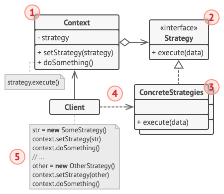

# Strategy

The Strategy Pattern defines a family of algorithms, encapsulates each one, and makes them interchangeable. Strategy lets the algorithm vary independently of clients that use it.

1. The **Context** maintains a reference to one of the concrete strategies and communicates with this object only via the strategy interface.

2. The **Strategy** interface is common to all concrete strategies. It declares a method the context uses to execute a strategy.

3. **Concrete Strategies** implement different variations of an algorithm the context uses.

4. The context calls the execution method on the linked strategy object each time it needs to run the algorithm. The context doesn’t know what type of strategy it works with or how the algorithm is executed.

5. The **Client** creates a specific strategy object and passes it to the context. The context exposes a setter which lets clients replace the strategy associated with the context at runtime.

## Advantages of the Strategy Pattern
 Open/Closed Principle: You can introduce new strategies without having to change the context.

 You can swap algorithms used inside an object at runtime.

 You can isolate the implementation details of an algorithm from the code that uses it.

 You can replace inheritance with composition.

## Considerations and Potential Drawbacks
If you only have a couple of algorithms, and they rarely change, there’s no real reason to overcomplicate the program with new classes and interfaces that come along with the pattern.

Clients must be aware of the differences between strategies to be able to select a proper one.

A lot of modern programming languages have functional type support that lets you implement different versions of an algorithm inside a set of anonymous functions. Then you could use these functions exactly as you’d have used the strategy objects, but without bloating your code with extra classes and interfaces.
