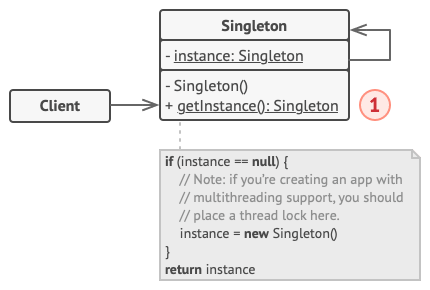

# Singleton

Use the Singleton pattern when a class in your program should have just a single instance available to all clients; 
for example, a single database object or a client shared by different parts of the program.

## Advantages of the Singleton Pattern
- You can be sure that a class has **only a single instance**. 
- You gain a **global access** point to that instance.
- The singleton object is **initialized only when it’s requested for the first time**.
 
## Considerations and Potential Drawbacks
- **Single Responsibility Principle**: Violates the **Single Responsibility Principle**. The pattern solves two problems at the time.
- **Mask bad design**: The Singleton pattern **can mask bad design**, for instance, when the components of the program know too much about each other.
- **Multithreaded Environment**: The pattern requires special treatment in a **multithreaded environment** so that multiple threads won’t create a singleton object several times.
- **Unit test**: It may be difficult to **unit test** the client code of the Singleton because many test frameworks rely on inheritance when producing mock objects. Since the constructor of the singleton class is private and overriding static methods is impossible in most languages, you will need to think of a creative way to mock the singleton. Or just don’t write the tests. Or don’t use the Singleton pattern.