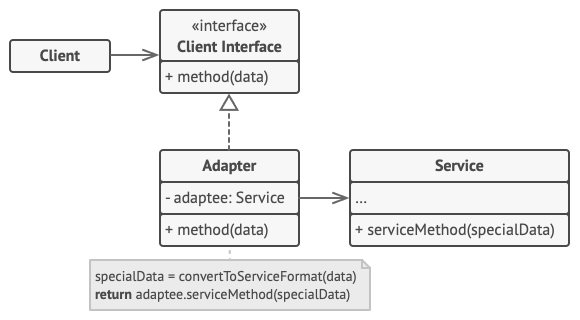

# Adapter

It works as a bridge between two incompatible interfaces. This pattern involves a single class which is responsible to join functionalities of independent or incompatible interfaces.

## Key Components of the Adapter Pattern

**Target Interface**: The target interface defines the contract that the client code expects. It is the interface the adapter will conform to, allowing the client to interact with the adaptee seamlessly.

**Adaptee**: The adaptee is the class or component with an incompatible interface. It’s the object you want to make use of but cannot interact with directly from the client. Usually a 3rd party or legacy service.

**Adapter**: The intermediary that bridges the gap between the target interface and the adaptee. It translates calls from the client in a way that the adaptee can understand and respond to.

## Advantages of the Adapter Pattern
The Adapter pattern offers several advantages when applied judiciously:

**Code Reusability**: Adapters facilitate code reuse by integrating existing classes without altering their source, reducing redundancy and enabling well-tested code in new contexts.

**Principle of Single Responsibility**: The Adapter pattern aligns with the principle of single responsibility, ensuring that each class has a clear and specific role, thus improving code organization and maintainability.

**Open/Closed Principle**: By adapting existing interfaces rather than modifying them directly, the Adapter pattern adheres to the open/closed principle, allowing for extension without altering existing code, enhancing system stability.

**Integration of Third-Party Code**: When using external libraries or APIs, the Adapter pattern eases their integration, shielding your codebase from external changes and minimizing disruptions during updates.

## Considerations and Potential Drawbacks
**Complexity**: Adapters can add complexity, especially with many to manage, impacting code maintainability.

**Performance Overhead**: The added layer may introduce slight performance overhead, a concern for high-performance applications.

**Design Implications**: Adapter use may signal original design issues; consider comprehensive refactoring for core interface incompatibilities.