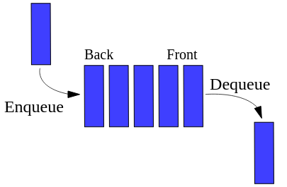

# Queue

Fila (queue) é uma estrutura do tipo FIFO (first in, first out), o primeiro elemento a entrar na pilha é o primeiro elemento a sair. Uma fila possui duas funções básicas que são adicionar elemento ao final da fila e remover o elemento que está no inicio da fila.

São exemplos de uso de fila em um sistema:

- Controle de documentos para impressão;
- Troca de mensagem entre computadores numa rede;

Os elementos não se movem na fila, conforme o primeiro elemento é retirado. Isto seria muito custoso para o computador. O que se faz na realidade é indicar quem é o primeiro.

As filas, assim como as pilhas, podem ser **implementadas** de duas formas:

- **Forma estática**, usando array (vetor);
- **Forma dinâmica**, usando lista encadeada (ponteiros).
