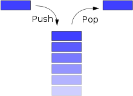

# Stacks

Pilha (Stacks) é uma estrutura do tipo FILO (first in, last out), onde o último elemento a ser inserido, será o primeiro a ser retirado. Assim, uma pilha permite acesso a apenas um item de dados - o último inserido. Para processar o penúltimo item inserido, deve-se remover o último.

São exemplos de uso de pilha em um sistema:

- Funções recursivas em compiladores;
- Mecanismo de desfazer/refazer dos editores de texto;
- Navegação entre páginas Web;

As pilhas ocorrem em estruturas de natureza recursiva (como árvores). Elas são utilizadas
para implementar a recursividade.

- Pilha Sequencial

  As Pilhas Sequenciais utilizam um array para armazenar os dados. Assim, os dados sempre estarão em um *espaço contíguo* de memória.

  **Vantagem:** A Pilha Sequencial tem a vantagem de ser bastante simples de implementar, ocupando um espaço constante (na memória) para todas operações.

  **Desvantagem:** Existe a limitação física de quantidade máxima de posições imposta pela alocação estática, não permitindo que a pilha ultrapasse esse limite.

---

- Pilha Encadeada

  A implementação do TAD (Tipo Abstrato de Dado) Pilha pode ser feito através de uma *estrutura encadeada* com alocação dinâmica de memória.

  **Vantagem:** A vantagem é não precisar pre-determinar uma capacidade máxima da pilha (o limite é a memória do computador!). A Pilha Encadeada é flexível em relação ao espaço de memória, permitindo maior ou menor utilização.

  **Desvantagem:**

  1. Depender de implementações ligeiramente mais complexas
  2. Tende a ter acessos de memória ligeiramente mais lentos, devido ao espalhamento dos elementos por toda a memória do computador (perdendo as vantagens de acesso rápido na *memória cache*, por exemplo).
  3. Gasto de espaço extra com ponteiros em cada elemento, o que não acontece na Pilha Sequencial.
